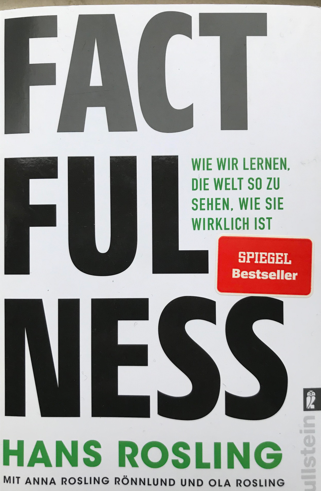

# FACTFULLNESS

## Cover

## Author
Hans Rosling
* 1948-07-27 - 2017-02-07
* Physician and public speaker
* Professor of International Health at Karolinska Insitute in Sweden
* Co-Founder and chairman of the [Gapminder Foundation](https://en.wikipedia.org/wiki/Gapminder_Foundation)
* Dedicated to spread a data based view on the world

## Chapters
* [Introduction](#Introduction)
1. [The Gap Instinct](#1-the-gap-instinct)
2. [The Negativity Instinct](#2-the-negativity-instinct)
3. [The Straight Line Instinct](#3-the-straight-line-instinct)
4. [The Fear Instinct](#4-the-fear-instinct)
5. [The Size Instinct](#5-the-size-instinct)
6. [The Generalization Instinct](#6-the-generalization-instinct)
7. [The Density Instinct](#7-the-density-instinct)
8. [The Single Perspective Instinct](#8-the-single-perspective-instinct)
9. [The Blame Instinct](#9-the-blame-instinct)
10. [The Urgency Instinct](#10-the-urgency-instinct)
11. [Factfullness in Practice](#11-factfullness-in-practice)
*  [Factfullness Rules of Thumb](#factfullness-rules-of-thumb)

## Introduction
### TL;DR
* Hans Rosling's passion for sharing data based knowledge was triggered by the misconception of his students about the condition of the world
* He found that the misconception was not because the lack of knowledge or outdated knowledge but by a over-dramatisation which is caused by the way our brain works
* Broad research in 2017 including 12000 people in 14 countries showed that the misconceptions does not differ in different areas or for different degrees of education

### Short Summary
* Hans Rosling starts with a test asking the reader 13 questions about the condition of the world in order to show how bad our sense for the current condition of the world acutally is. These are questions like *"How did the number of deaths due to natural disasters develop in the last 100 years?"* or *"Worldwide 30 year old men visited a school for 10 years on average. How many years did women of the same age visit school?"*
* Tells about what triggered his wish to spread data-based knowledge about the real condition of the world
  * As he started teaching International Health at Karolinska Institute in the mid ninetees he recognized that his studends had a distorted view on the different facts about the world
* He had three theories about what could be the reason for the misconceptions
  * *Missing knowledge* which could not be true as the answers in his questionaires were not randomly wrong but systematically wrong
  * *Outdated knowledge* which people got from the outdated knowledge from their teachers. This turned out to be wrong as even after his presentations people tended to have discussions that the data just cannot be true and the actual state of the world is worse
  * *Natural given over-dramatisation* proved to be the reason for the misconceptions. This he found was not mainly triggered by e.g. media but by the way our brain works  
* Tells about a reasearch project in 2017 where 1200 people in 14 countries were asked the 13 questions mentioned above. In average only 2 of 13 questions were answered right.  

### Comments
I find some of the 13 questions asked are open for interpretation without more details. Two examples:
* *"What percentage of people worldwide can access electricity to a certain degree?"* - What does *"to a certain degree"* mean? Is this a fixed definition, e.g. being able to use a light bulb? Did this definition change over the years?
* *"How did the number of people worldwide living in extreme poverty develop in the past 20 years"* - How is *"extreme poverty"* defined? Is it agreed across the scientific world what it means? Did the definition change in the past 20 years? ...  

It seems that it is a simplified view on complex topics which allow different interpretations. Especially when answering the 13 questions I had the desire to ask a bunge of question in order be be able to answer them.  
This is the impression only having read the introduction. This might change in the next chapters.

## 1. The Gap Instinct
### TL;DR
* First big misconception or *mega fallacy* is that people think the world is divided in two (*we* and *they* or *rich* and *poor*) -> Rosling calls it the *Gap Instinct*
* Rosling creates a model with four levels of income instead of just having *poor* and *rich*
   * Level 1: $1 a day
   * Level 2: $2-$8 a day
   * Level 3: $8-$32 a day
   * Level 4: more than $32 a day
* Rosling gives three signals which enforce the *Gap Instinct* and that he sais must be questioned when we face them:
   * *Comparison of averages* -> Whenever averages are compared we should take the real numbers in order to identify overlaps that might be hidden by the averages
   * *Comparison of extremes* -> We should focus more on the majority of the population instead of the two extremes (e.g. super rich and extremely poor)
   * *View from the top* -> On low income levels differences mean a lot. We should not think of all income levels below us as *poor*, but we should differentiate with the model (see above) he proposes

### Short Summary
* Rosling describes the first big misconception or *mega fallacy* as he calls it: people think the world is divided in two (*we* and *they* or *rich* and *poor*)
* This is caused by the *Gap Instinct*: 
   * It is easier and more compelling to us to think in gaps. E.g. our first world and the third world
   * Also it is enforced through the media: Rosling sais Journalists are story tellers who try to get the most interesting story out of a situation; Documentaries show alsways big discrepancies (e.g. big companies vs poor workers; well developed countries with a well developed welfare state vs dictatorships,...)
* Rosling creates a model of four income levels which are more differentiated than the classification of the world in two groups (poor and rich). This model helps avoiding thinking in a binary pattern which implies a gap by its nature:
   * Level 1: $1 a day
   * Level 2: $2-$8 a day
   * Level 3: $8-$32 a day
   * Level 4: more than $32 a day
* Rosling states three identifiers of when we are in danger to think falesly in gaps and tells how to avoid it
   * *Comparison of averages*: When average numbers are compared there is always a loss of information -> Avoid this by comparing the raw data in order to identify overlaps which might be not visible when comparing averages
   * *Comparison of extremes*: Often extremes are taken as examples (e.g. super rich vs poor) -> Focus more on the majority, in most cases the majority is someqhere in the middle
   * *View from the top*: People tend to loose the sense for differences of lower income levels when they are on the top e.g. for a rich person in the US there is most probably not a big difference between someone who earns $1 a day or someone who earns $8 a day. But it makes a huge difference -> Try to be more differentiated, Rosling suggests to use his 4 

### Comments
I agree that the binary perception of the world into *rich* and *poor* is wrong. So refining the model into different income groups makes sense like Rosling suggests make sense. However, it is also not explained into detail. E.g. the currency differences: level 3 with $8-$32 income a day would be in some countries a rather high income that would mean a quite luxury way of life. In other countries this is at the lower end (e.g. per definition it's poor in the US).  

Also it is difficult to ccept the definition of low and middle income as we're used to a much higher level. E.g. Rosling labels middle income as $8-$32 which means that you have cold water supply (can also be a well), you can afford basic education for part of your children and probably you can afford basic devices like a refrigerator when saving for several years. By our definition this is by no means middle income but rather at the extrem low end of income levels. But Rosling wants to make a point in comparing the licing standards over decates. 50-70 years ago much more people lived under worse conditions than that on income levels 1 and 2. So in fact when comparing the licing standards from that perspective it increased a lot in the past century.  

Regarding the three warning signals that lead to the *gap thinking* I like Rosling's explanations as they make one recognize that this way of thinking appears quite often. E.g. the *View from the top* example is quite true as most of the people tend to label different licing standards just as *poor* even if there are huge differences for people moving up from one level to the next.

## 2. The Negativity Instinct
## 3. The Straight Line Instinct
## 4. The Fear Instinct
## 5. The Size Instinct
## 6. The Generalization Instinct
## 7. The Density Instinct
## 8. The Single PErspective Instinct
## 9. The Blame Instinct
## 10. The Urgency Instinct
## 11. Factfullness in Practice
## Factfullness Rules of Thumb

